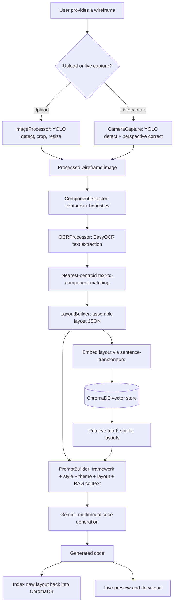
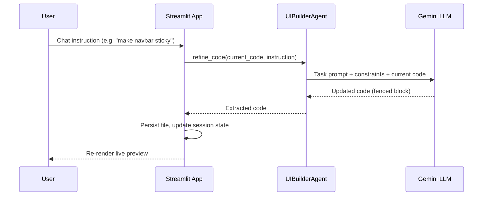

# 🚀 VisionCraft Studio

### Sketch it, speak it, ship it — hand-drawn wireframes to production-ready code across 11 frameworks


-lightgrey)

> **A note on this documentation:** it was generated directly from the application source (`app.py`, `camera.py`, `image_preprocess.py`, `ocr.py`, `speech.py`, `llm.py`, `agent.py`, `rag.py`, `html_preview.py`) — no `requirements.txt`, `LICENSE`, or `best.pt` training details were shared alongside it. The dependency list, license, badges, and repo name below are reasonable inferences, not confirmed facts — swap in your real choices before publishing.

## Table of Contents
- [Overview](#overview)
- [Problem Statement](#problem-statement)
- [Solution](#solution)
- [Key Features](#key-features)
- [Architecture](#architecture)
- [Refinement Workflow](#refinement-workflow)
- [Tech Stack](#tech-stack)
- [Project Structure](#project-structure)
- [Getting Started](#getting-started)
- [Configuration](#configuration)
- [Usage](#usage)
- [Code Walkthrough](#code-walkthrough)
- [Performance and Operational Notes](#performance-and-operational-notes)
- [Known Limitations](#known-limitations)
- [Future Scope](#future-scope)
- [Screenshots and Demo](#screenshots-and-demo)
- [Contributing](#contributing)
- [License](#license)
- [Acknowledgements](#acknowledgements)
- [Contact](#contact)

## Overview

**VisionCraft Studio** (in-app: *Wireframe To Code Studio*, engine version *VisionCraft AI Engine 2.1*) is a Streamlit application that turns a hand-drawn wireframe — uploaded as a photo or captured live from a webcam — into working frontend code. It combines classical computer vision, OCR, retrieval-augmented generation, and a multimodal LLM into a single pipeline, then layers a conversational agent on top so the generated code can be refined by chatting with it in plain English.

## Problem Statement

Turning a hand-drawn wireframe or whiteboard sketch into working frontend code is still a manual, repetitive step in most product workflows. A developer has to interpret a rough sketch, guess at spacing and hierarchy, and hand-code a first draft before real iteration can even start — and that overhead multiplies with every framework or design system a team has to target.

## Solution

VisionCraft Studio closes that gap. Point a camera or upload a photo of a wireframe, optionally narrate extra requirements out loud, and the app detects the layout, reads any handwritten labels, and generates working code in the framework, theme, and design system of your choice. From there, a chat-based refinement agent lets you keep iterating conversationally, without leaving the browser.

## Key Features

- 🖼️ **Dual capture modes** — upload a photo or capture live via webcam, with automatic paper/wireframe detection and perspective correction
- 🧩 **CV-based component detection** — contour analysis classifies navbars, sidebars, buttons, input fields, cards, images, and text areas
- 🔤 **OCR-aware layout** — EasyOCR extracts handwritten or printed labels and matches each one to its nearest detected component
- 🎙️ **Voice-dictated instructions** — speak extra design requirements instead of typing them
- 🎨 **11 frameworks × 8 themes × 10 design systems** — generate HTML/CSS, Tailwind, Bootstrap, React, Next.js, Vue, Angular, Svelte, Streamlit, Flask, or Django output in the visual style you choose
- 🧠 **RAG-grounded generation** — a ChromaDB-backed retrieval layer surfaces similar past layouts to steady the model's output, and every new generation is indexed back in
- 🤖 **Conversational refinement agent** — a CrewAI-orchestrated "Senior Frontend Architect" agent applies natural-language edits to the generated code while explicitly preserving backend template logic (e.g. Django tags)
- 👀 **Live preview & one-click download** — see HTML output rendered inline, get framework-specific run instructions for the rest, and download the file directly
- 🔍 **Built-in debug panel** — inspect the source image, perspective correction, bounding boxes, OCR overlay, and layout JSON behind any generation

## Architecture



Voice dictation (`speech.py`) feeds into the instruction text box at any point before generation and isn't shown above as a separate branch for clarity.

## Refinement Workflow

Once code exists, it can be refined conversationally instead of regenerated from scratch:



The agent's task explicitly instructs it not to touch Django template tags, variables, or data-rendering loops — styling changes only — which suggests this refinement loop was designed to be safe to run against a real backend-integrated app, not just static demo code.

## Tech Stack

| Layer | Technology | Role in VisionCraft Studio |
|---|---|---|
| UI / app shell | Streamlit | Renders the interface: input controls, tabs, chat widget, live preview |
| Computer vision | OpenCV | Perspective correction, contour detection, image preprocessing |
| Object detection | Ultralytics YOLO | Custom-trained model (`best.pt`) that locates the paper/wireframe in a frame or upload |
| OCR | EasyOCR | Extracts handwritten/printed text and matches it to components |
| Voice input | SpeechRecognition (Google Speech API) | Converts spoken design instructions to text |
| Code generation | Google Gemini (multimodal) | Generates framework-specific code from layout + RAG context + source image |
| Refinement agent | CrewAI | Orchestrates a "Senior Frontend Architect" agent that edits code from chat instructions |
| RAG retrieval | ChromaDB + sentence-transformers (`BAAI/bge-base-en-v1.5`) | Stores past layouts and retrieves similar ones to ground new prompts |
| Config | python-dotenv | Loads `GOOGLE_API_KEY` from `.env` |
| Image I/O | Pillow (PIL) | Image loading and format conversion |

**Why this stack, briefly:** OpenCV + a custom YOLO model handles the "find the wireframe" problem faster and more controllably than asking an LLM to localize it; EasyOCR is a reasonable no-frills choice for handwriting-adjacent text without standing up a full document-AI service; ChromaDB is a lightweight, embeddable vector store well suited to a single-user Streamlit app (versus running a hosted vector DB); and CrewAI gives the refinement step a structured "agent with a role and constraints" abstraction instead of hand-rolling prompt plumbing for every edit.

## Project Structure

```
visioncraft-studio/
├── app.py                  # Streamlit entrypoint & UI orchestration (assumed filename)
├── camera.py                # Webcam capture + YOLO detection + perspective correction
├── image_preprocess.py      # ImageProcessor, ComponentDetector, LayoutBuilder
├── ocr.py                   # OCRProcessor — EasyOCR extraction + component matching
├── speech.py                 # Voice dictation (SpeechRecognition)
├── llm.py                     # Gemini multimodal code generation
├── agent.py                   # UIBuilderAgent — CrewAI refinement agent
├── rag.py                      # VisionCraftRAG — embeddings, vector store, prompt builder
├── html_preview.py             # Streamlit HTML rendering/saving utility
├── best.pt                      # ⚠️ not included — your trained YOLO weights go here
├── requirements.txt              # Python dependencies (reconstructed — see below)
├── .env                            # GOOGLE_API_KEY (never commit this)
├── uploads/                        # Saved uploads (auto-created)
├── captures/                       # Saved webcam captures (auto-created)
├── generated/                      # Generated code output (auto-created)
└── vector_db/                      # ChromaDB persistence directory (auto-created)
```

## Getting Started

### Prerequisites
- Python 3.10+
- A webcam (optional — only needed for live capture mode)
- A microphone (optional — only needed for voice dictation)
- A Google AI Studio API key (`GOOGLE_API_KEY`) with Gemini access
- A trained YOLO model (`best.pt`) for paper/wireframe detection — see [Configuration](#configuration)

### Installation
```bash
git clone https://github.com/<your-username>/visioncraft-studio.git
cd visioncraft-studio

python -m venv venv
source venv/bin/activate      # Windows: venv\Scripts\activate

pip install -r requirements.txt
```

`requirements.txt` (reconstructed from imports — pin exact versions once tested):
```
streamlit
opencv-python
numpy
Pillow
ultralytics
easyocr
SpeechRecognition
PyAudio
google-generativeai
python-dotenv
crewai
chromadb
sentence-transformers
```

> `PyAudio` can be finicky: on Linux, run `sudo apt-get install portaudio19-dev` before `pip install`; on Windows, grab a matching pre-built wheel if the plain install fails.

## Configuration

Create a `.env` file in the project root:
```
GOOGLE_API_KEY=your_gemini_api_key_here
```

Place your trained wireframe/paper-detection YOLO weights at `best.pt` in the project root. This model's training data and process aren't part of this codebase — documenting that separately (dataset size, classes, mAP) would strengthen this README further.

On first run: EasyOCR downloads its detection/recognition models (needs internet access once), and ChromaDB creates a local `vector_db/` folder to persist the RAG store.

## Usage

```bash
streamlit run app.py
```

1. Choose a **Framework**, **Theme**, and **Design System** in the Frontend Specifications panel.
2. Optionally type — or speak via **🎤 Quick Voice Dictation** — any extra design instructions.
3. Upload a wireframe photo, or switch to **📷 Live Capture** to use your webcam.
4. Click **🚀 Build Production Code** to run the CV → OCR → RAG → Gemini pipeline.
5. Review the result under **Live Result Preview** or **Source Code & Copy**, and download it.
6. Keep refining with the **AI Code Copilot Agent** chat — describe a change in plain English and it rewrites the code in place.

## Code Walkthrough

| File | Purpose | Key classes / functions | Notable dependencies |
|---|---|---|---|
| `app.py` | Streamlit UI orchestration: layout, input capture, pipeline trigger, output tabs, refinement chat | script-level | streamlit, all other modules |
| `camera.py` | Live webcam capture with YOLO-based paper detection and perspective correction | `CameraCapture` (`capture`, `perspective_from_crop`, `four_point_transform`, `order_points`) | opencv-python, ultralytics |
| `image_preprocess.py` | Upload-path image processing, component detection, layout assembly | `ImageProcessor`, `ComponentDetector`, `LayoutBuilder` | opencv-python, ultralytics, numpy, Pillow |
| `ocr.py` | Text extraction and text-to-component matching | `OCRProcessor` (`extract_text`, `to_json`, `match_components`, `process`) | easyocr, opencv-python |
| `speech.py` | Converts microphone input to text for design instructions | `listen()` | SpeechRecognition |
| `llm.py` | Calls Gemini with the assembled prompt (+ source image) to generate code | `generate_code()` | google-generativeai |
| `agent.py` | Chat-driven code refinement via a CrewAI agent, preserving backend template syntax | `UIBuilderAgent` (`refine_code`, `_extract_code`) | crewai |
| `rag.py` | Embeds layouts, stores/retrieves similar ones, builds the final LLM prompt | `EmbeddingGenerator`, `VisionVectorStore`, `LayoutRetriever`, `PromptBuilder`, `VisionCraftRAG` | chromadb, sentence-transformers |
| `html_preview.py` | Renders and saves generated HTML for the live preview tab | `HTMLPreview` | streamlit |

**A few worth elaborating on:**

- **`rag.py`** is built as a small facade: `EmbeddingGenerator` turns a layout dict into text and then a vector, `VisionVectorStore` wraps ChromaDB CRUD, `LayoutRetriever` combines the two into "give me similar past layouts," and `PromptBuilder` assembles the final Gemini prompt from framework/style/theme rules plus that retrieved context. `VisionCraftRAG` is the single entrypoint `app.py` actually talks to.
- **`camera.py`** has two different perspective-correction paths: the primary one uses the YOLO-detected bounding box directly; `perspective_from_crop()` is a Canny-edge + contour fallback that finds a 4-point polygon within a crop. It also opens native OpenCV windows (`cv2.imshow`) for the live capture UI, which only works when the app is run locally — see [Known Limitations](#known-limitations).
- **`agent.py`**'s refinement task is intentionally narrow: the prompt tells the LLM to change styling only, and to leave Django template tags, variables, and data-rendering loops for bank entries/user tables/feedback forms untouched — a strong signal this was designed to be reused safely against a real backend template, not just throwaway demo markup.

## Performance and Operational Notes

This project doesn't train or evaluate a bespoke classifier with held-out data, so classic metrics like accuracy/precision/F1/mAP don't map cleanly onto it as a whole:

- **Paper/wireframe detection** relies on a custom YOLO model (`best.pt`) whose training data and evaluation metrics aren't part of this codebase. If you have mAP/precision numbers for it, add them here.
- **Component classification** is rule-based (fixed width/height/aspect-ratio thresholds in `ComponentDetector.classify`), not a trained model — so it has no accuracy figure, but it also has no training cost and is instantly explainable when it misclassifies something.
- **OCR** runs on CPU (`easyocr.Reader(..., gpu=False)`), which will be the slowest step on larger or high-resolution images.
- **End-to-end latency** is the sum of YOLO inference, OCR, an embedding + ChromaDB query, and a Gemini API round-trip — each generation makes at least one external API call, so expect multi-second latency and factor in Gemini rate limits for demo purposes.
- **RAG retrieval** is capped at `top_k=2` in the current wiring, intentionally kept small to reduce the chance of the LLM copying noisy historical layouts (there's an explicit "anti-rotation" guardrail injected into the prompt for the same reason).

## Known Limitations

- **Live webcam capture won't work on a deployed/cloud instance.** `camera.py` uses `cv2.VideoCapture(0)` and `cv2.imshow()`, which need a local display and local webcam access — this only works running `streamlit run app.py` on your own machine, not on Streamlit Community Cloud or a headless server. Swapping in Streamlit's native `st.camera_input()` would fix this (see [Future Scope](#future-scope)).
- **Component classification is heuristic, not learned**, so it's sensitive to sketch scale and drawing style — thresholds tuned for one wireframe style may misclassify another.
- **English-only OCR** by default (EasyOCR is initialized with `["en"]`).
- **No retry/error handling** around the Gemini, EasyOCR, or ChromaDB calls in the main flow — a transient API error or rate limit will surface as an unhandled exception in the Streamlit session.
- **Style configuration is duplicated**: `rag.py`'s `PromptBuilder.STYLE_RULES` and `llm.py`'s `STYLE_PROMPTS` cover similar ground, and `STYLE_PROMPTS` doesn't currently appear to be used in `generate_code()` — worth consolidating.
- **Gemini model versions are inconsistent** across call sites (`agent.py` uses `gemini/gemini-3.5-flash`, `llm.py` uses `gemini-3.6-flash`) — worth centralizing into one config value.

## Future Scope

- Replace the local webcam flow with `st.camera_input()` for browser-based, cloud-deployable capture
- Train a lightweight learned classifier to replace (or support) the geometric heuristics in `ComponentDetector`
- Multi-language OCR support
- Multi-file project export for frameworks that expect a real project scaffold (React/Next.js), not a single file
- Centralize style/theme prompt configuration into one source of truth
- Add error handling and retries around external API/DB calls so a transient failure doesn't crash the session
- Add automated tests, including a small labeled dataset to benchmark the component-detection heuristics against
- User accounts or saved project history beyond the shared RAG store

## Screenshots and Demo

*(Add screenshots once available — e.g. `docs/screenshot-input.png`, `docs/screenshot-generated-code.png`)*

*(Add a short demo GIF — the debug panel plus live preview make for a strong 10–15s clip)*

*(Add a link to a demo video once recorded — see the suggested script below)*

## Contributing

Contributions are welcome. Fork the repo, create a feature branch (`git checkout -b feature/your-feature`), commit your changes, and open a pull request. For larger changes, please open an issue first to discuss what you'd like to change.

## License

No license file is included yet. MIT is a common, permissive choice for portfolio projects like this — add a `LICENSE` file once you've decided (happy to generate the MIT text if you confirm).

## Acknowledgements

Built on top of some excellent open-source and API-based tools: [Streamlit](https://streamlit.io/), [OpenCV](https://opencv.org/), [Ultralytics YOLO](https://www.ultralytics.com/), [EasyOCR](https://github.com/JaidedAI/EasyOCR), [Google Gemini](https://ai.google.dev/), [CrewAI](https://www.crewai.com/), [ChromaDB](https://www.trychroma.com/), and [Sentence-Transformers](https://www.sbert.net/).

## Contact

**Arjun** — add your GitHub, LinkedIn, and email here.
Feel free to open an issue or reach out directly with questions or feedback.
